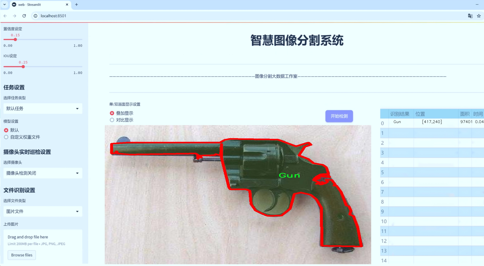

# 枪械图像分割系统源码＆数据集分享
 [yolov8-seg-ContextGuidedDown＆yolov8-seg-C2f-SCcConv等50+全套改进创新点发刊_一键训练教程_Web前端展示]

### 1.研究背景与意义

项目参考[ILSVRC ImageNet Large Scale Visual Recognition Challenge](https://gitee.com/YOLOv8_YOLOv11_Segmentation_Studio/projects)

项目来源[AAAI Global Al lnnovation Contest](https://kdocs.cn/l/cszuIiCKVNis)

研究背景与意义

随着社会的快速发展，枪械的管理与监控问题日益凸显。枪械的非法流通与使用不仅威胁到公共安全，也对社会稳定造成了严重影响。因此，如何有效地识别和分割枪械图像，成为了计算机视觉领域和安全监控领域的重要研究课题。近年来，深度学习技术的迅猛发展为图像处理提供了新的解决方案，尤其是目标检测与分割领域的突破，使得基于深度学习的枪械图像识别系统逐渐成为可能。

YOLO（You Only Look Once）系列模型因其高效的实时检测能力而广受欢迎。YOLOv8作为该系列的最新版本，结合了更先进的网络结构和优化算法，具备了更强的特征提取能力和更快的推理速度。然而，现有的YOLOv8模型在特定场景下的枪械图像分割任务中，仍然存在一定的局限性，尤其是在复杂背景和多样化枪械类型的情况下。因此，针对YOLOv8进行改进，以提升其在枪械图像分割任务中的表现，具有重要的研究意义。

本研究将基于改进的YOLOv8模型，构建一个专门针对枪械图像的分割系统。我们将使用一个包含1600张图像的数据集，该数据集分为两类：枪械和其他物体。这一数据集的构建不仅为模型的训练提供了丰富的样本，也为后续的模型评估与优化奠定了基础。通过对图像进行精细的标注与分类，我们能够更好地训练模型，使其在复杂场景中准确识别和分割枪械，进而提高系统的实用性和可靠性。

此外，枪械图像分割系统的研究不仅具有理论价值，也具备重要的实际应用意义。随着智能监控技术的普及，基于深度学习的图像识别系统在安防、执法等领域的应用日益广泛。通过实现高效的枪械图像分割，能够为公共安全提供有效的技术支持，帮助执法部门及时发现和处理潜在的安全隐患。同时，该系统也可为枪械管理、犯罪预防等领域提供数据支持，促进社会的和谐与稳定。

综上所述，基于改进YOLOv8的枪械图像分割系统的研究，不仅有助于推动计算机视觉技术的发展，也为社会安全提供了切实可行的解决方案。通过不断优化模型和完善数据集，我们期望能够在枪械图像识别领域取得更大的突破，为相关研究和应用提供有力的支持。

### 2.图片演示





##### 注意：由于此博客编辑较早，上面“2.图片演示”和“3.视频演示”展示的系统图片或者视频可能为老版本，新版本在老版本的基础上升级如下：（实际效果以升级的新版本为准）

  （1）适配了YOLOV8的“目标检测”模型和“实例分割”模型，通过加载相应的权重（.pt）文件即可自适应加载模型。

  （2）支持“图片识别”、“视频识别”、“摄像头实时识别”三种识别模式。

  （3）支持“图片识别”、“视频识别”、“摄像头实时识别”三种识别结果保存导出，解决手动导出（容易卡顿出现爆内存）存在的问题，识别完自动保存结果并导出到tempDir中。

  （4）支持Web前端系统中的标题、背景图等自定义修改，后面提供修改教程。

  另外本项目提供训练的数据集和训练教程,暂不提供权重文件（best.pt）,需要您按照教程进行训练后实现图片演示和Web前端界面演示的效果。

### 3.视频演示

[3.1 视频演示](https://www.bilibili.com/video/BV1sCyBYPEpN/)

### 4.数据集信息展示

##### 4.1 本项目数据集详细数据（类别数＆类别名）

nc: 1
names: ['Gun']


##### 4.2 本项目数据集信息介绍

数据集信息展示

在本研究中，我们采用了名为“Gun Segmentation”的数据集，以训练和改进YOLOv8-seg模型，旨在实现高效的枪械图像分割系统。该数据集专注于枪械的识别与分割，具有独特的应用价值，尤其是在安全监控、执法及军事领域。数据集的设计考虑到了实际应用中的多样性与复杂性，尽管其类别数量仅为1，但在这一类别下，包含了丰富的图像样本，确保了模型训练的全面性与有效性。

“Gun Segmentation”数据集的类别数量为1，具体类别为“Gun”。这一设计反映了研究的聚焦点，旨在通过深度学习技术，精确识别和分割图像中的枪械对象。尽管类别数量有限，但数据集中的图像样本涵盖了多种类型的枪械，包括手枪、步枪、霰弹枪等，且在不同的环境和背景下拍摄。这种多样性不仅提高了模型的泛化能力，还增强了其在复杂场景下的鲁棒性。

数据集中的图像经过精心挑选和标注，确保每一张图像都能有效地反映出枪械的特征。标注过程中，采用了精确的分割技术，将枪械与背景清晰区分开来。这种高质量的标注为YOLOv8-seg模型的训练提供了坚实的基础，使其能够学习到枪械的形状、轮廓及其他关键特征。此外，数据集还包含了多种光照条件、角度和背景的图像，模拟了真实世界中可能遇到的各种情况，进一步提升了模型的适应性。

在数据集的构建过程中，特别注重了数据的多样性和代表性。我们确保样本的均衡性，以避免模型在某一特定类型的枪械上过拟合。通过对不同类型枪械的多角度拍摄和不同环境的设置，数据集有效地涵盖了枪械在现实生活中的多种表现形式。这种设计理念不仅提升了模型的训练效果，也为后续的实际应用提供了可靠的支持。

为了确保数据集的有效性和实用性，我们还进行了严格的数据预处理和增强操作。这些操作包括图像的裁剪、旋转、缩放及颜色调整等，旨在增加数据集的多样性，帮助模型更好地适应不同的输入条件。这些预处理步骤不仅提高了模型的训练效率，还增强了其在实际应用中的表现能力。

综上所述，“Gun Segmentation”数据集为训练和改进YOLOv8-seg模型提供了一个高质量的基础。通过专注于枪械这一单一类别，结合丰富的样本和严格的标注，数据集有效地支持了图像分割任务的开展。随着模型的不断优化和迭代，我们期待这一系统能够在实际应用中发挥重要作用，为安全监控和执法工作提供有力的技术支持。


### 5.全套项目环境部署视频教程（零基础手把手教学）

[5.1 环境部署教程链接（零基础手把手教学）](https://www.bilibili.com/video/BV1jG4Ve4E9t/?vd_source=bc9aec86d164b67a7004b996143742dc)


[5.2 安装Python虚拟环境创建和依赖库安装视频教程链接（零基础手把手教学）](https://www.bilibili.com/video/BV1nA4VeYEze/?vd_source=bc9aec86d164b67a7004b996143742dc)

### 6.手把手YOLOV8-seg训练视频教程（零基础小白有手就能学会）

[6.1 手把手YOLOV8-seg训练视频教程（零基础小白有手就能学会）](https://www.bilibili.com/video/BV1cA4VeYETe/?vd_source=bc9aec86d164b67a7004b996143742dc)


按照上面的训练视频教程链接加载项目提供的数据集，运行train.py即可开始训练



     Epoch   gpu_mem       box       obj       cls    labels  img_size
     1/200     0G   0.01576   0.01955  0.007536        22      1280: 100%|██████████| 849/849 [14:42<00:00,  1.04s/it]
               Class     Images     Labels          P          R     mAP@.5 mAP@.5:.95: 100%|██████████| 213/213 [01:14<00:00,  2.87it/s]
                 all       3395      17314      0.994      0.957      0.0957      0.0843

     Epoch   gpu_mem       box       obj       cls    labels  img_size
     2/200     0G   0.01578   0.01923  0.007006        22      1280: 100%|██████████| 849/849 [14:44<00:00,  1.04s/it]
               Class     Images     Labels          P          R     mAP@.5 mAP@.5:.95: 100%|██████████| 213/213 [01:12<00:00,  2.95it/s]
                 all       3395      17314      0.996      0.956      0.0957      0.0845

     Epoch   gpu_mem       box       obj       cls    labels  img_size
     3/200     0G   0.01561    0.0191  0.006895        27      1280: 100%|██████████| 849/849 [10:56<00:00,  1.29it/s]
               Class     Images     Labels          P          R     mAP@.5 mAP@.5:.95: 100%|███████   | 187/213 [00:52<00:00,  4.04it/s]
                 all       3395      17314      0.996      0.957      0.0957      0.0845


### 7.50+种全套YOLOV8-seg创新点代码加载调参视频教程（一键加载写好的改进模型的配置文件）

[7.1 50+种全套YOLOV8-seg创新点代码加载调参视频教程（一键加载写好的改进模型的配置文件）](https://www.bilibili.com/video/BV1Hw4VePEXv/?vd_source=bc9aec86d164b67a7004b996143742dc)

### 8.YOLOV8-seg图像分割算法原理

原始YOLOv8-seg算法原理

YOLOv8-seg算法是YOLO系列的最新进展，基于YOLOv8的目标检测框架，进一步扩展了其在图像分割任务中的应用。该算法在设计上承袭了YOLOv5和YOLOv7的优良特性，并在此基础上进行了多项创新和改进，以实现更高效的目标检测和精确的图像分割。

首先，YOLOv8-seg的网络结构依然由输入层、主干网络、特征融合层和解耦头组成。其主干网络采用了CSPDarknet结构，结合了C2f模块的设计理念。C2f模块的引入不仅提升了模型的轻量化特性，还在保持检测精度的同时，增强了特征提取的能力。C2f模块通过将特征图分为两个分支进行处理，允许更丰富的梯度流动，从而有效缓解了深层网络中的梯度消失问题。这种设计使得YOLOv8-seg能够在处理复杂图像时，提取出更为细致的特征信息。

在特征融合方面，YOLOv8-seg采用了PAN-FPN结构，这一结构的优势在于能够充分融合多尺度特征信息。通过自下而上的特征融合，YOLOv8-seg能够将高层特征与中层、浅层特征有效结合，从而在目标检测和分割任务中实现更高的准确性。特征融合的过程不仅增强了模型对不同尺度目标的检测能力，还提高了对细节信息的捕捉能力，确保了在复杂场景下的鲁棒性。

YOLOv8-seg的另一大创新在于其采用了Anchor-Free的检测策略。传统的目标检测算法通常依赖于预定义的锚框，而YOLOv8-seg通过抛弃锚框的使用，转而采用更为灵活的目标检测方法。这一转变使得模型在处理多样化目标时，能够更好地适应不同的目标形状和大小，进而提升了检测精度和效率。

在损失函数的设计上，YOLOv8-seg引入了VFLLoss作为分类损失，并结合DFLLoss和CIoULoss作为回归损失。这种损失函数的组合使得模型在训练过程中能够更好地平衡正负样本的影响，尤其是在样本不平衡的情况下，VFLLoss通过对正负样本的加权处理，有效提升了模型对难以分类样本的学习能力。

样本匹配策略方面，YOLOv8-seg采用了Task-Aligned的Assigner匹配方式。这一策略相较于传统的静态匹配方法，能够动态调整样本的匹配关系，使得模型在训练过程中更具灵活性和适应性。这种动态匹配方式确保了模型在不同训练阶段能够高效利用样本信息，从而提升了整体的训练效果。

在数据预处理方面，YOLOv8-seg延续了YOLOv5的策略，采用了包括马赛克增强、混合增强、空间扰动和颜色扰动等多种数据增强手段。这些增强技术不仅丰富了训练数据的多样性，还有效提升了模型的泛化能力，使得YOLOv8-seg在面对不同场景和条件下的图像时，依然能够保持良好的性能。

YOLOv8-seg的解耦头结构是其另一大亮点。与传统的耦合头结构不同，YOLOv8-seg的解耦头将分类和回归任务分开处理，这一设计使得模型在进行目标分类和位置回归时能够更为专注，从而提高了检测精度。解耦头的设计不仅提升了模型的灵活性，还为后续的图像分割任务提供了更为精准的特征支持。

综上所述，YOLOv8-seg算法通过对YOLOv8框架的多项创新和改进，成功地将目标检测与图像分割任务结合在一起。其在主干网络、特征融合、损失函数、样本匹配和解耦头等多个方面的优化，使得YOLOv8-seg在处理复杂场景时，能够实现更高的检测精度和更好的分割效果。这一算法的提出，不仅为目标检测和图像分割领域带来了新的思路，也为后续的研究和应用提供了重要的参考。随着YOLOv8-seg的不断发展和完善，未来在实际应用中将展现出更为广泛的潜力和价值。


### 9.系统功能展示（检测对象为举例，实际内容以本项目数据集为准）

图9.1.系统支持检测结果表格显示

  图9.2.系统支持置信度和IOU阈值手动调节

  图9.3.系统支持自定义加载权重文件best.pt(需要你通过步骤5中训练获得)

  图9.4.系统支持摄像头实时识别

  图9.5.系统支持图片识别

  图9.6.系统支持视频识别

  图9.7.系统支持识别结果文件自动保存

  图9.8.系统支持Excel导出检测结果数据


### 10.50+种全套YOLOV8-seg创新点原理讲解（非科班也可以轻松写刊发刊，V11版本正在科研待更新）

#### 10.1 由于篇幅限制，每个创新点的具体原理讲解就不一一展开，具体见下列网址中的创新点对应子项目的技术原理博客网址【Blog】：


[10.1 50+种全套YOLOV8-seg创新点原理讲解链接](https://gitee.com/qunmasj/good)

#### 10.2 部分改进模块原理讲解(完整的改进原理见上图和技术博客链接)【如果此小节的图加载失败可以通过CSDN或者Github搜索该博客的标题访问原始博客，原始博客图片显示正常】

### YOLOv8简介

按照官方描述，YOLOv8 是一个 SOTA 模型，它建立在以前 YOLO 版本的成功基础上，并引入了新的功能和改进，以进一步提升性能和灵活性。具体创新包括一个新的骨干网络、一个新的 Ancher-Free 检测头和一个新的损失函数，可以在从 CPU 到 GPU 的各种硬件平台上运行。

不过 ultralytics 并没有直接将开源库命名为 YOLOv8，而是直接使用 ultralytics 这个词，原因是 ultralytics 将这个库定位为算法框架，而非某一个特定算法，一个主要特点是可扩展性。其希望这个库不仅仅能够用于 YOLO 系列模型，而是能够支持非 YOLO 模型以及分类分割姿态估计等各类任务。
总而言之，ultralytics 开源库的两个主要优点是：

融合众多当前 SOTA 技术于一体
未来将支持其他 YOLO 系列以及 YOLO 之外的更多算法


下表为官方在 COCO Val 2017 数据集上测试的 mAP、参数量和 FLOPs 结果。可以看出 YOLOv8 相比 YOLOv5 精度提升非常多，但是 N/S/M 模型相应的参数量和 FLOPs 都增加了不少，从上图也可以看出相比 YOLOV5 大部分模型推理速度变慢了。


额外提一句，现在各个 YOLO 系列改进算法都在 COCO 上面有明显性能提升，但是在自定义数据集上面的泛化性还没有得到广泛验证，至今依然听到不少关于 YOLOv5 泛化性能较优异的说法。对各系列 YOLO 泛化性验证也是 MMYOLO 中一个特别关心和重点发力的方向。

### YOLO-MS简介
实时目标检测，以YOLO系列为例，已在工业领域中找到重要应用，特别是在边缘设备（如无人机和机器人）中。与之前的目标检测器不同，实时目标检测器旨在在速度和准确性之间追求最佳平衡。为了实现这一目标，提出了大量的工作：从第一代DarkNet到CSPNet，再到最近的扩展ELAN，随着性能的快速增长，实时目标检测器的架构经历了巨大的变化。

尽管性能令人印象深刻，但在不同尺度上识别对象仍然是实时目标检测器面临的基本挑战。这促使作者设计了一个强大的编码器架构，用于学习具有表现力的多尺度特征表示。具体而言，作者从两个新的角度考虑为实时目标检测编码多尺度特征：

从局部视角出发，作者设计了一个具有简单而有效的分层特征融合策略的MS-Block。受到Res2Net的启发，作者在MS-Block中引入了多个分支来进行特征提取，但不同的是，作者使用了一个带有深度卷积的 Inverted Bottleneck Block块，以实现对大Kernel的高效利用。

从全局视角出发，作者提出随着网络加深逐渐增加卷积的Kernel-Size。作者在浅层使用小Kernel卷积来更高效地处理高分辨率特征。另一方面，在深层中，作者采用大Kernel卷积来捕捉广泛的信息。

基于以上设计原则，作者呈现了作者的实时目标检测器，称为YOLO-MS。为了评估作者的YOLO-MS的性能，作者在MS COCO数据集上进行了全面的实验。还提供了与其他最先进方法的定量比较，以展示作者方法的强大性能。如图1所示，YOLO-MS在计算性能平衡方面优于其他近期的实时目标检测器。


具体而言，YOLO-MS-XS在MS COCO上获得了43%+的AP得分，仅具有450万个可学习参数和8.7亿个FLOPs。YOLO-MS-S和YOLO-MS分别获得了46%+和51%+的AP，可学习参数分别为810万和2220万。此外，作者的工作还可以作为其他YOLO模型的即插即用模块。通常情况下，作者的方法可以将YOLOv8的AP从37%+显著提高到40%+，甚至还可以使用更少的参数和FLOPs。


#### Multi-Scale Building Block Design
CSP Block是一个基于阶段级梯度路径的网络，平衡了梯度组合和计算成本。它是广泛应用于YOLO系列的基本构建块。已经提出了几种变体，包括YOLOv4和YOLOv5中的原始版本，Scaled YOLOv4中的CSPVoVNet，YOLOv7中的ELAN，以及RTMDet中提出的大Kernel单元。作者在图2(a)和图2(b)中分别展示了原始CSP块和ELAN的结构。


上述实时检测器中被忽视的一个关键方面是如何在基本构建块中编码多尺度特征。其中一个强大的设计原则是Res2Net，它聚合了来自不同层次的特征以增强多尺度表示。然而，这一原则并没有充分探索大Kernel卷积的作用，而大Kernel卷积已经在基于CNN的视觉识别任务模型中证明有效。将大Kernel卷积纳入Res2Net的主要障碍在于它们引入的计算开销，因为构建块采用了标准卷积。在作者的方法中，作者提出用 Inverted Bottleneck Block替代标准的3 × 3卷积，以享受大Kernel卷积的好处。

基于前面的分析，作者提出了一个带有分层特征融合策略的全新Block，称为MS-Block，以增强实时目标检测器在提取多尺度特征时的能力，同时保持快速的推理速度。

MS-Block的具体结构如图2(c)所示。假设是输入特征。通过1×1卷积的转换后，X的通道维度增加到n*C。然后，作者将X分割成n个不同的组，表示为，其中。为了降低计算成本，作者选择n为3。

注意，除了之外，每个其他组都经过一个 Inverted Bottleneck Block层，用表示，其中k表示Kernel-Size，以获得。的数学表示如下：


根据这个公式，该博客的作者不将 Inverted Bottleneck Block层连接，使其作为跨阶段连接，并保留来自前面层的信息。最后，作者将所有分割连接在一起，并应用1×1卷积来在所有分割之间进行交互，每个分割都编码不同尺度的特征。当网络加深时，这个1×1卷积也用于调整通道数。

#### Heterogeneous Kernel Selection Protocol
除了构建块的设计外，作者还从宏观角度探讨了卷积的使用。之前的实时目标检测器在不同的编码器阶段采用了同质卷积（即具有相同Kernel-Size的卷积），但作者认为这不是提取多尺度语义信息的最佳选项。

在金字塔结构中，从检测器的浅阶段提取的高分辨率特征通常用于捕捉细粒度语义，将用于检测小目标。相反，来自网络较深阶段的低分辨率特征用于捕捉高级语义，将用于检测大目标。如果作者在所有阶段都采用统一的小Kernel卷积，深阶段的有效感受野（ERF）将受到限制，影响大目标的性能。在每个阶段中引入大Kernel卷积可以帮助解决这个问题。然而，具有大的ERF的大Kernel可以编码更广泛的区域，这增加了在小目标外部包含噪声信息的概率，并且降低了推理速度。

在这项工作中，作者建议在不同阶段中采用异构卷积，以帮助捕获更丰富的多尺度特征。具体来说，在编码器的第一个阶段中，作者采用最小Kernel卷积，而最大Kernel卷积位于最后一个阶段。随后，作者逐步增加中间阶段的Kernel-Size，使其与特征分辨率的增加保持一致。这种策略允许提取细粒度和粗粒度的语义信息，增强了编码器的多尺度特征表示能力。

正如图所示，作者将k的值分别分配给编码器中的浅阶段到深阶段，取值为3、5、7和9。作者将其称为异构Kernel选择（HKS）协议。


作者的HKS协议能够在深层中扩大感受野，而不会对浅层产生任何其他影响。此外，HKS不仅有助于编码更丰富的多尺度特征，还确保了高效的推理。

如表1所示，将大Kernel卷积应用于高分辨率特征会产生较高的计算开销。然而，作者的HKS协议在低分辨率特征上采用大Kernel卷积，从而与仅使用大Kernel卷积相比，大大降低了计算成本。


在实践中，作者经验性地发现，采用HKS协议的YOLO-MS的推理速度几乎与仅使用深度可分离的3 × 3卷积相同。

#### Architecture
如图所示，作者模型的Backbone由4个阶段组成，每个阶段后面跟随1个步长为2的3 × 3卷积进行下采样。在第3个阶段后，作者添加了1个SPP块，与RTMDet中一样。在作者的编码器上，作者使用PAFPN作为Neck来构建特征金字塔[31, 35]。它融合了从Backbone不同阶段提取的多尺度特征。Neck中使用的基本构建块也是作者的MS-Block，在其中使用3 × 3深度可分离卷积进行快速推理。

此外，为了在速度和准确性之间取得更好的平衡，作者将Backbone中多级特征的通道深度减半。作者提供了3个不同尺度的YOLO-MS变体，即YOLO-MS-XS、YOLO-MS-S和YOLO-MS。不同尺度的YOLO-MS的详细配置列在表2中。对于YOLO-MS的其他部分，作者将其保持与RTMDet相同。


### 11.项目核心源码讲解（再也不用担心看不懂代码逻辑）

#### 11.1 ultralytics\models\yolo\model.py

以下是对代码的核心部分进行保留和详细注释的结果：

```python
# Ultralytics YOLO 🚀, AGPL-3.0 license

from ultralytics.engine.model import Model  # 导入基础模型类
from ultralytics.models import yolo  # 导入YOLO模型相关模块

class YOLO(Model):
    """YOLO (You Only Look Once) 目标检测模型类。"""

    @property
    def task_map(self):
        """将任务类型映射到相应的模型、训练器、验证器和预测器类。"""
        return {
            'classify': {  # 分类任务
                'model': ClassificationModel,  # 分类模型
                'trainer': yolo.classify.ClassificationTrainer,  # 分类训练器
                'validator': yolo.classify.ClassificationValidator,  # 分类验证器
                'predictor': yolo.classify.ClassificationPredictor,  # 分类预测器
            },
            'detect': {  # 检测任务
                'model': DetectionModel,  # 检测模型
                'trainer': yolo.detect.DetectionTrainer,  # 检测训练器
                'validator': yolo.detect.DetectionValidator,  # 检测验证器
                'predictor': yolo.detect.DetectionPredictor,  # 检测预测器
            },
            'segment': {  # 分割任务
                'model': SegmentationModel,  # 分割模型
                'trainer': yolo.segment.SegmentationTrainer,  # 分割训练器
                'validator': yolo.segment.SegmentationValidator,  # 分割验证器
                'predictor': yolo.segment.SegmentationPredictor,  # 分割预测器
            },
            'pose': {  # 姿态估计任务
                'model': PoseModel,  # 姿态模型
                'trainer': yolo.pose.PoseTrainer,  # 姿态训练器
                'validator': yolo.pose.PoseValidator,  # 姿态验证器
                'predictor': yolo.pose.PosePredictor,  # 姿态预测器
            },
        }
```

### 代码分析
1. **类定义**：`YOLO`类继承自`Model`类，表示YOLO目标检测模型的实现。
2. **属性方法**：`task_map`是一个属性方法，返回一个字典，字典中将不同的任务类型（如分类、检测、分割和姿态估计）映射到相应的模型、训练器、验证器和预测器类。
3. **任务映射**：
   - `classify`：处理分类任务的相关类。
   - `detect`：处理目标检测任务的相关类。
   - `segment`：处理图像分割任务的相关类。
   - `pose`：处理姿态估计任务的相关类。

这个结构使得YOLO模型能够灵活地支持多种任务类型，便于扩展和维护。

这个文件定义了一个名为 `YOLO` 的类，该类继承自 `Model`，用于实现 YOLO（You Only Look Once）目标检测模型。YOLO 是一种流行的实时目标检测算法，能够在单个前向传播中同时进行目标分类和定位。

在这个类中，有一个名为 `task_map` 的属性，它返回一个字典，映射了不同任务类型（如分类、检测、分割和姿态估计）到相应的模型、训练器、验证器和预测器类。这个映射使得在使用 YOLO 模型时，可以根据具体的任务类型方便地选择相应的组件。

具体来说，`task_map` 中的每个任务类型都包含以下内容：
- `model`：对应的模型类，例如 `ClassificationModel`、`DetectionModel`、`SegmentationModel` 和 `PoseModel`。
- `trainer`：用于训练模型的类，例如 `ClassificationTrainer`、`DetectionTrainer` 等。
- `validator`：用于验证模型性能的类，例如 `ClassificationValidator`、`DetectionValidator` 等。
- `predictor`：用于进行预测的类，例如 `ClassificationPredictor`、`DetectionPredictor` 等。

通过这种结构，用户可以方便地扩展和使用 YOLO 模型来处理不同的计算机视觉任务，同时保持代码的清晰和模块化。这个设计模式有助于实现代码的复用和维护。

#### 11.2 log.py

以下是经过简化和注释的核心代码部分：

```python
import os
import time
import cv2
import pandas as pd
from PIL import Image

def save_chinese_image(file_path, image_array):
    """
    保存带有中文路径的图片文件

    参数：
    file_path (str): 图片的保存路径，应包含中文字符
    image_array (numpy.ndarray): 要保存的 OpenCV 图像（即 numpy 数组）
    """
    try:
        # 将 OpenCV 图片转换为 Pillow Image 对象
        image = Image.fromarray(cv2.cvtColor(image_array, cv2.COLOR_BGR2RGB))
        # 使用 Pillow 保存图片文件
        image.save(file_path)
        print(f"成功保存图像到: {file_path}")
    except Exception as e:
        print(f"保存图像失败: {str(e)}")

class ResultLogger:
    def __init__(self):
        """
        初始化ResultLogger类，创建一个空的DataFrame用于存储识别结果
        """
        self.results_df = pd.DataFrame(columns=["识别结果", "位置", "面积", "时间"])

    def concat_results(self, result, location, confidence, time):
        """
        将检测结果添加到结果DataFrame中

        参数：
            result (str): 检测结果
            location (str): 检测位置
            confidence (str): 置信度
            time (str): 检出目标所在时间

        返回：
            pd.DataFrame: 更新后的DataFrame
        """
        # 创建一个包含这些信息的字典
        result_data = {
            "识别结果": [result],
            "位置": [location],
            "面积": [confidence],
            "时间": [time]
        }
        # 创建一个新的DataFrame并将其添加到实例的DataFrame
        new_row = pd.DataFrame(result_data)
        self.results_df = pd.concat([self.results_df, new_row], ignore_index=True)
        return self.results_df

class LogTable:
    def __init__(self, csv_file_path=None):
        """
        初始化LogTable类实例，尝试从CSV文件加载数据

        参数：
            csv_file_path (str): 保存初始数据的CSV文件路径
        """
        self.csv_file_path = csv_file_path
        columns = ['文件路径', '识别结果', '位置', '面积', '时间']
        # 尝试从CSV文件加载数据，如果失败则创建一个空的DataFrame
        if not os.path.exists(csv_file_path):
            empty_df = pd.DataFrame(columns=columns)
            empty_df.to_csv(csv_file_path, index=False, header=True)
        self.data = pd.DataFrame(columns=columns)

    def add_log_entry(self, file_path, recognition_result, position, confidence, time_spent):
        """
        向日志中添加一条新记录

        参数：
            file_path (str): 文件路径
            recognition_result (str): 识别结果
            position (str): 位置
            confidence (float): 置信度
            time_spent (float): 用时（通常是秒或毫秒）

        返回：
            None
        """
        # 创建新的数据行
        new_entry = pd.DataFrame([[file_path, recognition_result, position, confidence, time_spent]],
                                 columns=['文件路径', '识别结果', '位置', '面积', '时间'])
        # 将新行添加到DataFrame中
        self.data = pd.concat([new_entry, self.data]).reset_index(drop=True)

    def save_to_csv(self):
        """
        将更新后的DataFrame保存到CSV文件
        """
        self.data.to_csv(self.csv_file_path, index=False, encoding='utf-8', mode='a', header=False)

    def update_table(self, log_table_placeholder):
        """
        更新表格，显示最新的500条记录

        参数：
            log_table_placeholder: 表格占位符

        返回：
            None
        """
        # 判断DataFrame的长度是否超过500
        display_data = self.data.head(500) if len(self.data) > 500 else self.data
        log_table_placeholder.table(display_data)
```

### 代码注释说明：
1. **save_chinese_image**: 该函数用于保存带有中文路径的图片。它接收文件路径和图像数组，使用Pillow库将OpenCV图像转换并保存。
  
2. **ResultLogger类**: 该类用于记录识别结果，初始化时创建一个空的DataFrame，`concat_results`方法用于将新的识别结果添加到DataFrame中。

3. **LogTable类**: 该类用于管理日志数据，能够从CSV文件加载数据，添加新记录，保存数据到CSV文件，并更新显示的表格。 

通过以上注释，代码的核心功能和逻辑得以清晰呈现。

这个程序文件`log.py`主要用于处理图像和记录识别结果，结合了图像处理、数据存储和日志记录的功能。程序中使用了多个库，包括`os`、`time`、`cv2`（OpenCV）、`pandas`、`PIL`（Pillow）和`numpy`，这些库为图像处理和数据操作提供了支持。

首先，程序定义了一个名为`save_chinese_image`的函数，用于保存带有中文路径的图像文件。该函数接受两个参数：文件路径和图像数组。它将OpenCV格式的图像转换为Pillow的图像对象，然后使用Pillow保存图像。如果保存成功，会打印成功信息；如果失败，则会捕获异常并打印错误信息。

接下来，程序定义了一个`ResultLogger`类，用于记录识别结果。该类在初始化时创建一个空的DataFrame，包含“识别结果”、“位置”、“面积”和“时间”四个列。`concat_results`方法用于将新的检测结果添加到DataFrame中。该方法接收识别结果、位置、置信度和时间，并将这些信息存储在一个新的DataFrame中，然后与现有的DataFrame合并。

然后，程序定义了一个`LogTable`类，负责管理图像和结果的存储。该类在初始化时可以接受一个CSV文件路径，用于加载初始数据。如果指定的CSV文件不存在，程序会创建一个空的DataFrame并保存为CSV文件。该类还包含多个方法，如`add_frames`用于添加图像和检测信息，`clear_frames`用于清空存储的图像和结果，`save_frames_file`用于保存图像或视频，`add_log_entry`用于向日志中添加新记录，`clear_data`用于清空数据，`save_to_csv`用于将DataFrame保存到CSV文件，以及`update_table`用于更新表格以显示最新的记录。

在`save_frames_file`方法中，程序根据存储的图像数量决定是保存为单张图片还是视频。如果只有一张图像，则保存为PNG格式；如果有多张图像，则保存为AVI格式的视频。该方法还会处理文件名的生成，并确保文件路径的有效性。

整体来看，这个程序文件的设计使得用户能够方便地进行图像的处理、结果的记录和数据的存储，适用于需要图像识别和数据分析的场景。

#### 11.3 ui.py

以下是代码中最核心的部分，并附上详细的中文注释：

```python
import sys
import subprocess

def run_script(script_path):
    """
    使用当前 Python 环境运行指定的脚本。

    Args:
        script_path (str): 要运行的脚本路径

    Returns:
        None
    """
    # 获取当前 Python 解释器的路径
    python_path = sys.executable

    # 构建运行命令，使用 streamlit 运行指定的脚本
    command = f'"{python_path}" -m streamlit run "{script_path}"'

    # 执行命令
    result = subprocess.run(command, shell=True)
    # 检查命令执行的返回码，如果不为0则表示出错
    if result.returncode != 0:
        print("脚本运行出错。")

# 实例化并运行应用
if __name__ == "__main__":
    # 指定要运行的脚本路径
    script_path = "web.py"  # 这里可以直接指定脚本路径

    # 调用函数运行脚本
    run_script(script_path)
```

### 代码注释说明：
1. **导入模块**：
   - `sys`：用于访问与 Python 解释器相关的变量和函数。
   - `subprocess`：用于执行外部命令和程序。

2. **定义 `run_script` 函数**：
   - 该函数接受一个参数 `script_path`，表示要运行的 Python 脚本的路径。
   - 函数内部首先获取当前 Python 解释器的路径，以便在命令中使用。

3. **构建命令**：
   - 使用 f-string 格式化字符串，构建运行 `streamlit` 的命令。

4. **执行命令**：
   - 使用 `subprocess.run` 执行构建的命令，并通过 `shell=True` 允许在 shell 中执行。
   - 检查命令的返回码，如果返回码不为0，表示脚本运行出错，打印错误信息。

5. **主程序入口**：
   - 使用 `if __name__ == "__main__":` 确保该代码块仅在脚本作为主程序运行时执行。
   - 指定要运行的脚本路径，并调用 `run_script` 函数执行该脚本。

这个程序文件名为 `ui.py`，其主要功能是使用当前的 Python 环境来运行一个指定的脚本。程序首先导入了必要的模块，包括 `sys`、`os` 和 `subprocess`，以及一个自定义的路径处理模块 `abs_path`。

在 `run_script` 函数中，首先获取当前 Python 解释器的路径，这通过 `sys.executable` 实现。接着，构建一个命令字符串，用于运行指定的脚本。这个命令使用了 `streamlit`，这是一个用于构建数据应用的框架。命令的格式是将 Python 解释器的路径与 `-m streamlit run` 以及脚本路径组合在一起。

然后，使用 `subprocess.run` 方法执行这个命令。该方法会在一个新的 shell 中运行命令，并等待其完成。如果脚本运行返回的状态码不为零，表示运行过程中出现了错误，程序会打印出“脚本运行出错”的提示信息。

在文件的最后部分，程序通过 `if __name__ == "__main__":` 判断是否是直接运行该脚本。如果是，则指定要运行的脚本路径为 `web.py`，这个路径是通过 `abs_path` 函数获取的，确保路径是绝对路径。最后，调用 `run_script` 函数来执行指定的脚本。

整体来看，这个程序的主要作用是为用户提供一个简单的接口，通过指定的脚本路径来运行一个 Streamlit 应用，便于在当前 Python 环境中快速启动数据应用。

#### 11.4 train.py

以下是代码中最核心的部分，并附上详细的中文注释：

```python
import os
import torch
import yaml
from ultralytics import YOLO  # 导入YOLO模型库

if __name__ == '__main__':  # 确保该模块被直接运行时才执行以下代码
    # 设置训练参数
    workers = 1  # 数据加载的工作进程数
    batch = 8  # 每个批次的样本数量
    device = "0" if torch.cuda.is_available() else "cpu"  # 检查是否有可用的GPU，选择设备

    # 获取数据集的配置文件路径
    data_path = abs_path(f'datasets/data/data.yaml', path_type='current')  # 数据集的yaml文件的绝对路径

    # 将路径格式转换为Unix风格
    unix_style_path = data_path.replace(os.sep, '/')
    # 获取目录路径
    directory_path = os.path.dirname(unix_style_path)

    # 读取YAML文件，保持原有顺序
    with open(data_path, 'r') as file:
        data = yaml.load(file, Loader=yaml.FullLoader)

    # 修改数据集路径
    if 'train' in data and 'val' in data and 'test' in data:
        data['train'] = directory_path + '/train'  # 更新训练集路径
        data['val'] = directory_path + '/val'      # 更新验证集路径
        data['test'] = directory_path + '/test'    # 更新测试集路径

        # 将修改后的数据写回YAML文件
        with open(data_path, 'w') as file:
            yaml.safe_dump(data, file, sort_keys=False)

    # 加载YOLO模型配置和权重
    model = YOLO(r"C:\codeseg\codenew\50+种YOLOv8算法改进源码大全和调试加载训练教程（非必要）\改进YOLOv8模型配置文件\yolov8-seg-C2f-Faster.yaml").load("./weights/yolov8s-seg.pt")

    # 开始训练模型
    results = model.train(  # 调用训练方法
        data=data_path,  # 指定训练数据的配置文件路径
        device=device,  # 指定使用的设备（GPU或CPU）
        workers=workers,  # 指定使用的工作进程数
        imgsz=640,  # 指定输入图像的大小为640x640
        epochs=100,  # 指定训练的轮数为100
        batch=batch,  # 指定每个批次的样本数量
    )
```

### 代码核心部分解释：
1. **导入必要的库**：导入`os`、`torch`、`yaml`和YOLO模型库，准备进行模型训练。
2. **设置训练参数**：定义数据加载的工作进程数、批次大小和设备选择（GPU或CPU）。
3. **获取数据集配置文件路径**：使用`abs_path`函数获取数据集的YAML配置文件的绝对路径。
4. **读取和修改YAML文件**：读取YAML文件内容，更新训练、验证和测试集的路径，并将修改后的内容写回文件。
5. **加载YOLO模型**：根据指定的配置文件和权重文件加载YOLO模型。
6. **开始训练模型**：调用模型的`train`方法，传入训练所需的参数，开始训练过程。

该程序文件 `train.py` 是一个用于训练 YOLO（You Only Look Once）模型的脚本。首先，程序导入了必要的库，包括操作系统库 `os`、深度学习框架 `torch`、YAML 处理库 `yaml`、YOLO 模型库 `ultralytics` 和用于图形界面的 `matplotlib`。在程序的主入口部分，首先设置了一些训练参数，包括工作进程数 `workers`、批次大小 `batch` 和设备类型 `device`。设备类型根据是否有可用的 GPU 进行判断，如果有则使用 GPU，否则使用 CPU。

接下来，程序构建了数据集的 YAML 文件的绝对路径，并将路径格式转换为 Unix 风格。然后，程序读取该 YAML 文件，获取数据集的配置信息。程序检查 YAML 文件中是否包含训练、验证和测试数据的路径，如果存在，则将这些路径修改为当前目录下的相应子目录，并将修改后的内容写回 YAML 文件。

在模型加载部分，程序指定了 YOLO 模型的配置文件路径，并加载了预训练的权重文件。这里需要注意的是，不同的 YOLO 模型对设备的要求不同，如果出现错误，可以尝试更换其他模型进行测试。

最后，程序调用 `model.train()` 方法开始训练模型，传入了训练数据的配置文件路径、设备类型、工作进程数、输入图像大小、训练的 epoch 数量和批次大小等参数。这样，程序就可以开始进行模型的训练过程。

#### 11.5 ultralytics\nn\extra_modules\dynamic_snake_conv.py

以下是经过简化并添加详细中文注释的核心代码部分：

```python
import torch
import torch.nn as nn

class DySnakeConv(nn.Module):
    def __init__(self, inc, ouc, k=3) -> None:
        """
        动态蛇形卷积的初始化
        :param inc: 输入通道数
        :param ouc: 输出通道数
        :param k: 卷积核大小，默认为3
        """
        super().__init__()
        
        # 定义标准卷积
        self.conv_0 = Conv(inc, ouc, k)
        # 定义沿x轴和y轴的动态蛇形卷积
        self.conv_x = DSConv(inc, ouc, 0, k)
        self.conv_y = DSConv(inc, ouc, 1, k)
    
    def forward(self, x):
        """
        前向传播
        :param x: 输入特征图
        :return: 连接后的输出特征图
        """
        # 将三个卷积的输出在通道维度上拼接
        return torch.cat([self.conv_0(x), self.conv_x(x), self.conv_y(x)], dim=1)

class DSConv(nn.Module):
    def __init__(self, in_ch, out_ch, morph, kernel_size=3, if_offset=True, extend_scope=1):
        """
        动态蛇形卷积的初始化
        :param in_ch: 输入通道数
        :param out_ch: 输出通道数
        :param morph: 卷积核的形态（沿x轴或y轴）
        :param kernel_size: 卷积核大小
        :param if_offset: 是否需要偏移
        :param extend_scope: 扩展范围
        """
        super(DSConv, self).__init__()
        # 用于学习可变形偏移的卷积
        self.offset_conv = nn.Conv2d(in_ch, 2 * kernel_size, 3, padding=1)
        self.bn = nn.BatchNorm2d(2 * kernel_size)
        self.kernel_size = kernel_size

        # 定义沿x轴和y轴的动态卷积
        self.dsc_conv_x = nn.Conv2d(in_ch, out_ch, kernel_size=(kernel_size, 1), stride=(kernel_size, 1), padding=0)
        self.dsc_conv_y = nn.Conv2d(in_ch, out_ch, kernel_size=(1, kernel_size), stride=(1, kernel_size), padding=0)

        self.gn = nn.GroupNorm(out_ch // 4, out_ch)  # 组归一化
        self.act = Conv.default_act  # 默认激活函数

        self.extend_scope = extend_scope
        self.morph = morph
        self.if_offset = if_offset

    def forward(self, f):
        """
        前向传播
        :param f: 输入特征图
        :return: 经过动态卷积后的特征图
        """
        # 计算偏移
        offset = self.offset_conv(f)
        offset = self.bn(offset)
        offset = torch.tanh(offset)  # 将偏移限制在[-1, 1]之间

        # 进行可变形卷积
        dsc = DSC(f.shape, self.kernel_size, self.extend_scope, self.morph)
        deformed_feature = dsc.deform_conv(f, offset, self.if_offset)

        # 根据形态选择对应的卷积
        if self.morph == 0:
            x = self.dsc_conv_x(deformed_feature.type(f.dtype))
        else:
            x = self.dsc_conv_y(deformed_feature.type(f.dtype))

        x = self.gn(x)  # 归一化
        x = self.act(x)  # 激活
        return x

class DSC(object):
    def __init__(self, input_shape, kernel_size, extend_scope, morph):
        """
        动态卷积坐标映射的初始化
        :param input_shape: 输入特征图的形状
        :param kernel_size: 卷积核大小
        :param extend_scope: 扩展范围
        :param morph: 卷积核的形态
        """
        self.num_points = kernel_size
        self.width = input_shape[2]
        self.height = input_shape[3]
        self.morph = morph
        self.extend_scope = extend_scope

        # 定义特征图的形状
        self.num_batch = input_shape[0]
        self.num_channels = input_shape[1]

    def deform_conv(self, input, offset, if_offset):
        """
        进行可变形卷积
        :param input: 输入特征图
        :param offset: 偏移量
        :param if_offset: 是否需要偏移
        :return: 变形后的特征图
        """
        # 计算坐标映射
        y, x = self._coordinate_map_3D(offset, if_offset)
        # 进行双线性插值
        deformed_feature = self._bilinear_interpolate_3D(input, y, x)
        return deformed_feature

    # 省略其他方法以简化代码
```

### 代码注释说明：
1. **DySnakeConv**: 这是动态蛇形卷积的主类，负责初始化标准卷积和两个动态卷积（分别沿x轴和y轴）。
2. **DSConv**: 动态蛇形卷积的实现类，包含了可变形卷积的逻辑，能够根据输入特征图和偏移量进行动态卷积。
3. **DSC**: 负责处理坐标映射和双线性插值的类，主要用于实现可变形卷积的具体细节。
4. **forward方法**: 处理输入数据并返回经过卷积后的特征图，主要是将多个卷积的输出进行拼接。
5. **deform_conv方法**: 实现可变形卷积的核心逻辑，结合坐标映射和插值方法来得到变形后的特征图。

这个程序文件定义了一个动态蛇形卷积（Dynamic Snake Convolution）模块，主要用于深度学习中的卷积操作。文件中包含两个主要的类：`DySnakeConv` 和 `DSConv`，以及一个辅助类 `DSC`。

`DySnakeConv` 类是一个神经网络模块，继承自 `nn.Module`。在初始化方法中，它接受输入通道数 `inc`、输出通道数 `ouc` 和卷积核大小 `k`。该类内部定义了三个卷积层：`conv_0` 是标准卷积，`conv_x` 和 `conv_y` 是动态蛇形卷积，分别沿着 x 轴和 y 轴进行卷积。在前向传播方法中，输入数据 `x` 会通过这三个卷积层处理，然后将结果在通道维度上拼接（concatenate）在一起，形成最终的输出。

`DSConv` 类实现了动态蛇形卷积的具体操作。它的构造函数接受输入通道数、输出通道数、卷积核大小、形态参数、是否使用偏移等参数。该类内部首先定义了一个用于学习偏移量的卷积层 `offset_conv`，然后定义了两个卷积层 `dsc_conv_x` 和 `dsc_conv_y`，分别用于处理沿 x 轴和 y 轴的卷积。前向传播方法中，首先通过 `offset_conv` 计算出偏移量，然后利用这些偏移量生成变形特征图，最后根据形态参数选择合适的卷积层进行处理。

`DSC` 类是一个辅助类，用于计算坐标映射和双线性插值。它的构造函数接收输入特征图的形状、卷积核大小、扩展范围和形态参数。`_coordinate_map_3D` 方法根据偏移量生成新的坐标映射，而 `_bilinear_interpolate_3D` 方法则根据生成的坐标对输入特征图进行双线性插值，得到变形后的特征图。

整体来看，这个文件实现了一种新的卷积操作，能够根据输入特征图的特征动态调整卷积核的位置，从而提高卷积神经网络在特征提取上的灵活性和表现力。

#### 11.6 ultralytics\models\rtdetr\model.py

```python
# Ultralytics YOLO 🚀, AGPL-3.0 license
"""
RT-DETR接口，基于视觉变换器的实时目标检测器。RT-DETR提供实时性能和高准确性，
在CUDA和TensorRT等加速后端表现优异。它具有高效的混合编码器和IoU感知查询选择，
以提高检测准确性。

有关RT-DETR的更多信息，请访问：https://arxiv.org/pdf/2304.08069.pdf
"""

from ultralytics.engine.model import Model  # 导入基础模型类
from ultralytics.nn.tasks import RTDETRDetectionModel  # 导入RT-DETR检测模型

from .predict import RTDETRPredictor  # 导入预测器
from .train import RTDETRTrainer  # 导入训练器
from .val import RTDETRValidator  # 导入验证器


class RTDETR(Model):
    """
    RT-DETR模型接口。该基于视觉变换器的目标检测器提供实时性能和高准确性。
    它支持高效的混合编码、IoU感知查询选择和可调的推理速度。

    属性:
        model (str): 预训练模型的路径。默认为'rtdetr-l.pt'。
    """

    def __init__(self, model='rtdetr-l.pt') -> None:
        """
        使用给定的预训练模型文件初始化RT-DETR模型。支持.pt和.yaml格式。

        参数:
            model (str): 预训练模型的路径。默认为'rtdetr-l.pt'。

        异常:
            NotImplementedError: 如果模型文件扩展名不是'pt'、'yaml'或'yml'。
        """
        # 检查模型文件的扩展名是否有效
        if model and model.split('.')[-1] not in ('pt', 'yaml', 'yml'):
            raise NotImplementedError('RT-DETR仅支持从*.pt、*.yaml或*.yml文件创建。')
        # 调用父类构造函数进行初始化
        super().__init__(model=model, task='detect')

    @property
    def task_map(self) -> dict:
        """
        返回RT-DETR的任务映射，将任务与相应的Ultralytics类关联。

        返回:
            dict: 一个字典，将任务名称映射到RT-DETR模型的Ultralytics任务类。
        """
        return {
            'detect': {
                'predictor': RTDETRPredictor,  # 预测器类
                'validator': RTDETRValidator,  # 验证器类
                'trainer': RTDETRTrainer,  # 训练器类
                'model': RTDETRDetectionModel  # RT-DETR检测模型类
            }
        }
```

### 代码核心部分及注释说明：
1. **类定义**：`RTDETR`类继承自`Model`，用于实现RT-DETR模型的接口。
2. **初始化方法**：`__init__`方法用于初始化模型，检查模型文件的格式是否有效，并调用父类的初始化方法。
3. **任务映射**：`task_map`属性返回一个字典，映射不同的任务到相应的Ultralytics类，包括预测器、验证器、训练器和模型类。这使得在使用RT-DETR进行目标检测时，可以方便地调用不同的功能模块。

这个程序文件是Ultralytics库中的RT-DETR模型的实现，主要用于实时目标检测。RT-DETR是基于视觉变换器（Vision Transformer）的一种对象检测器，旨在提供高效的实时性能和高准确性，特别是在使用CUDA和TensorRT等加速后端时表现优异。该模型采用了高效的混合编码器和IoU（Intersection over Union）感知的查询选择机制，以提高检测的准确性。

文件中首先导入了必要的模块，包括Ultralytics引擎中的Model类和RTDETRDetectionModel类，以及用于预测、训练和验证的相关模块。接着定义了RTDETR类，该类继承自Model类，作为RT-DETR模型的接口。

在RTDETR类的构造函数中，接受一个参数model，默认值为'rtdetr-l.pt'，表示预训练模型的路径。构造函数中包含对模型文件扩展名的检查，确保只支持以.pt、.yaml或.yml结尾的文件。如果提供的文件扩展名不符合要求，将抛出NotImplementedError异常。

RTDETR类还定义了一个名为task_map的属性，该属性返回一个字典，映射了与RT-DETR模型相关的任务和相应的Ultralytics类。这些任务包括预测（predictor）、验证（validator）和训练（trainer），以及与之对应的模型类RTDETRDetectionModel。

总的来说，这个文件为RT-DETR模型提供了一个清晰的接口，便于用户进行目标检测任务的预测、训练和验证，同时确保了模型的高效性和准确性。

### 12.系统整体结构（节选）

### 整体功能和构架概括

该项目是一个基于Ultralytics库的计算机视觉框架，主要用于目标检测和图像处理。它实现了多种目标检测模型（如YOLO和RT-DETR），并提供了训练、预测和评估的功能。整个框架的设计旨在高效、灵活地处理各种计算机视觉任务，用户可以通过不同的模块和类来实现图像的训练、处理和结果记录。

项目的结构分为几个主要部分：
1. **模型定义**：包括YOLO和RT-DETR等模型的实现，负责模型的构建和前向传播。
2. **训练和验证**：提供训练模型的功能，支持数据集的加载和模型的评估。
3. **图像处理和日志记录**：实现图像的保存、结果的记录和日志的管理。
4. **用户界面**：提供一个简单的接口来运行和管理模型。
5. **辅助模块**：包括动态卷积和其他操作的实现，增强模型的功能。

### 文件功能整理表

| 文件路径                                                                                          | 功能描述                                                     |
|---------------------------------------------------------------------------------------------------|------------------------------------------------------------|
| `ultralytics/models/yolo/model.py`                                                                | 定义YOLO模型类，提供任务映射和模型组件选择功能。         |
| `log.py`                                                                                          | 处理图像保存和结果记录，管理识别结果的日志。             |
| `ui.py`                                                                                           | 提供一个接口来运行指定的Streamlit应用。                   |
| `train.py`                                                                                        | 负责训练YOLO模型，加载数据集和配置文件。                 |
| `ultralytics/nn/extra_modules/dynamic_snake_conv.py`                                             | 实现动态蛇形卷积模块，增强卷积操作的灵活性。             |
| `ultralytics/models/rtdetr/model.py`                                                              | 定义RT-DETR模型类，提供实时目标检测的接口。               |
| `demo_test_image.py`                                                                              | 运行演示测试，展示模型在测试图像上的表现。               |
| `ultralytics/nn/extra_modules/ops_dcnv3/functions/__init__.py`                                   | 初始化DCNv3模块的功能，提供动态卷积操作的支持。          |
| `ultralytics/utils/files.py`                                                                      | 提供文件操作的辅助函数，如路径处理和文件管理。           |
| `ultralytics/utils/downloads.py`                                                                  | 处理模型和数据集的下载功能，确保文件的可用性。           |
| `ultralytics/trackers/utils/matching.py`                                                         | 实现目标匹配算法，支持目标跟踪功能。                      |
| `ultralytics/models/sam/__init__.py`                                                              | 初始化SAM（Segment Anything Model）模型的功能。          |
| `ultralytics/engine/trainer.py`                                                                   | 提供训练引擎，管理训练过程中的各个环节。                  |

这个表格概述了每个文件的主要功能，帮助理解整个项目的结构和各个模块之间的关系。

注意：由于此博客编辑较早，上面“11.项目核心源码讲解（再也不用担心看不懂代码逻辑）”中部分代码可能会优化升级，仅供参考学习，完整“训练源码”、“Web前端界面”和“50+种创新点源码”以“14.完整训练+Web前端界面+50+种创新点源码、数据集获取”的内容为准。

### 13.图片、视频、摄像头图像分割Demo(去除WebUI)代码

在这个博客小节中，我们将讨论如何在不使用WebUI的情况下，实现图像分割模型的使用。本项目代码已经优化整合，方便用户将分割功能嵌入自己的项目中。
核心功能包括图片、视频、摄像头图像的分割，ROI区域的轮廓提取、类别分类、周长计算、面积计算、圆度计算以及颜色提取等。
这些功能提供了良好的二次开发基础。

### 核心代码解读

以下是主要代码片段，我们会为每一块代码进行详细的批注解释：

```python
import random
import cv2
import numpy as np
from PIL import ImageFont, ImageDraw, Image
from hashlib import md5
from model import Web_Detector
from chinese_name_list import Label_list

# 根据名称生成颜色
def generate_color_based_on_name(name):
    ......

# 计算多边形面积
def calculate_polygon_area(points):
    return cv2.contourArea(points.astype(np.float32))

...
# 绘制中文标签
def draw_with_chinese(image, text, position, font_size=20, color=(255, 0, 0)):
    image_pil = Image.fromarray(cv2.cvtColor(image, cv2.COLOR_BGR2RGB))
    draw = ImageDraw.Draw(image_pil)
    font = ImageFont.truetype("simsun.ttc", font_size, encoding="unic")
    draw.text(position, text, font=font, fill=color)
    return cv2.cvtColor(np.array(image_pil), cv2.COLOR_RGB2BGR)

# 动态调整参数
def adjust_parameter(image_size, base_size=1000):
    max_size = max(image_size)
    return max_size / base_size

# 绘制检测结果
def draw_detections(image, info, alpha=0.2):
    name, bbox, conf, cls_id, mask = info['class_name'], info['bbox'], info['score'], info['class_id'], info['mask']
    adjust_param = adjust_parameter(image.shape[:2])
    spacing = int(20 * adjust_param)

    if mask is None:
        x1, y1, x2, y2 = bbox
        aim_frame_area = (x2 - x1) * (y2 - y1)
        cv2.rectangle(image, (x1, y1), (x2, y2), color=(0, 0, 255), thickness=int(3 * adjust_param))
        image = draw_with_chinese(image, name, (x1, y1 - int(30 * adjust_param)), font_size=int(35 * adjust_param))
        y_offset = int(50 * adjust_param)  # 类别名称上方绘制，其下方留出空间
    else:
        mask_points = np.concatenate(mask)
        aim_frame_area = calculate_polygon_area(mask_points)
        mask_color = generate_color_based_on_name(name)
        try:
            overlay = image.copy()
            cv2.fillPoly(overlay, [mask_points.astype(np.int32)], mask_color)
            image = cv2.addWeighted(overlay, 0.3, image, 0.7, 0)
            cv2.drawContours(image, [mask_points.astype(np.int32)], -1, (0, 0, 255), thickness=int(8 * adjust_param))

            # 计算面积、周长、圆度
            area = cv2.contourArea(mask_points.astype(np.int32))
            perimeter = cv2.arcLength(mask_points.astype(np.int32), True)
            ......

            # 计算色彩
            mask = np.zeros(image.shape[:2], dtype=np.uint8)
            cv2.drawContours(mask, [mask_points.astype(np.int32)], -1, 255, -1)
            color_points = cv2.findNonZero(mask)
            ......

            # 绘制类别名称
            x, y = np.min(mask_points, axis=0).astype(int)
            image = draw_with_chinese(image, name, (x, y - int(30 * adjust_param)), font_size=int(35 * adjust_param))
            y_offset = int(50 * adjust_param)

            # 绘制面积、周长、圆度和色彩值
            metrics = [("Area", area), ("Perimeter", perimeter), ("Circularity", circularity), ("Color", color_str)]
            for idx, (metric_name, metric_value) in enumerate(metrics):
                ......

    return image, aim_frame_area

# 处理每帧图像
def process_frame(model, image):
    pre_img = model.preprocess(image)
    pred = model.predict(pre_img)
    det = pred[0] if det is not None and len(det)
    if det:
        det_info = model.postprocess(pred)
        for info in det_info:
            image, _ = draw_detections(image, info)
    return image

if __name__ == "__main__":
    cls_name = Label_list
    model = Web_Detector()
    model.load_model("./weights/yolov8s-seg.pt")

    # 摄像头实时处理
    cap = cv2.VideoCapture(0)
    while cap.isOpened():
        ret, frame = cap.read()
        if not ret:
            break
        ......

    # 图片处理
    image_path = './icon/OIP.jpg'
    image = cv2.imread(image_path)
    if image is not None:
        processed_image = process_frame(model, image)
        ......

    # 视频处理
    video_path = ''  # 输入视频的路径
    cap = cv2.VideoCapture(video_path)
    while cap.isOpened():
        ret, frame = cap.read()
        ......
```


### 14.完整训练+Web前端界面+50+种创新点源码、数据集获取


# [下载链接：https://mbd.pub/o/bread/Zp2amJls](https://mbd.pub/o/bread/Zp2amJls)